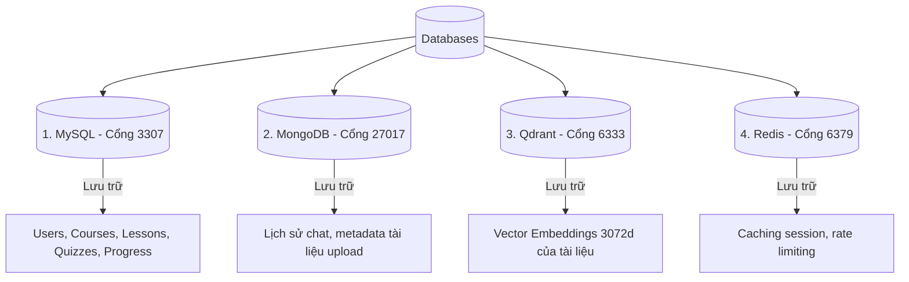
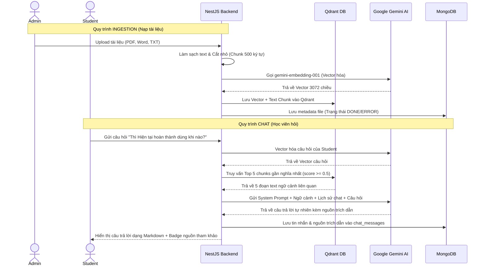

# 📑 BÁO CÁO THUYẾT TRÌNH DỰ ÁN: RAG E-LEARNING SYSTEM
> **Hệ thống Học tập Trực tuyến Tích hợp Trợ lý Ảo Thông minh (RAG AI Chatbot)**

---

## 💻 Slide 1: Giới Thiệu Chung
### **RAG E-Learning**
*Hệ thống E-Learning thế hệ mới kết hợp Trợ lý học tập thông minh (AI Chatbot) sử dụng kỹ thuật RAG (Retrieval-Augmented Generation).*

*   **Mục tiêu:** Tạo ra một nền tảng học tập trực tuyến năng động, nơi học viên không chỉ học qua bài viết/video mà còn được giải đáp thắc mắc 24/7 tức thời, chính xác theo tài liệu môn học.
*   **Điểm cốt lõi:** Trợ lý ảo trả lời dựa trên chính xác tài liệu do Admin/Giảng viên cung cấp, trích dẫn nguồn cụ thể, loại bỏ hiện tượng "ảo tưởng" (hallucination) của AI thông thường.

---

## 🏗️ Slide 2: Kiến Trúc Hệ Thống (Monorepo)
*Hệ thống được thiết kế theo mô hình Monorepo (quản lý cả FE và BE trong một kho mã nguồn duy nhất).*

```
rag-elearning/
├── apps/
│   ├── web/ (Next.js 15+ Frontend)
│   └── api/ (NestJS Backend API)
├── packages/ (Shared config/utilities nếu có)
└── package.json (Quản lý dự án tổng bằng pnpm-workspaces)
```

*   **Pnpm Workspaces:** Giúp tối ưu hóa tốc độ cài đặt dependencies, chia sẻ thư viện dễ dàng giữa FE và BE.
*   **Docker Compose:** Đóng gói toàn bộ môi trường cơ sở dữ liệu và hạ tầng trợ giúp để chạy local một cách nhất quang chỉ bằng 1 câu lệnh.

---

## 🛠️ Slide 3: Stack Công Nghệ Lựa Chọn (Technology Stack)

### **1. Frontend (apps/web)**
*   **Next.js 15 (App Router):** Tối ưu SSR (Server-Side Rendering) và tối ưu SEO vượt trội, trải nghiệm chuyển trang siêu mượt mà.
*   **Tailwind CSS + Shadcn UI:** Xây dựng giao diện hiện đại, chuyên nghiệp, responsive nhanh chóng dựa trên các component có sẵn chất lượng cao.
*   **Lucide Icons & Framer Motion:** Icon sắc nét và hiệu ứng micro-animations mượt mà cho trải nghiệm người dùng cao cấp.

### **2. Backend (apps/api)**
*   **NestJS Framework:** Thiết kế module rõ ràng, khả năng mở rộng cao, tích hợp Dependency Injection và TypeScript chuẩn doanh nghiệp.
*   **Prisma Client:** ORM hiện đại hỗ trợ làm việc với cơ sở dữ liệu quan hệ (MySQL) có type-safe cực kỳ mạnh mẽ.

---

## 🗄️ Slide 4: Kiến Trúc 4 Lớp Database (Vì sao dùng nhiều DB?)
*Để tối ưu hóa cho từng loại dữ liệu khác nhau, dự án sử dụng chiến lược **Polyglot Persistence** (mỗi loại dữ liệu lưu trữ ở một DB phù hợp nhất).*



### **Mục tiêu sử dụng:**
1.  **MySQL (Prisma):** Lưu trữ dữ liệu cấu trúc chặt chẽ (Người dùng, Khóa học, Bài học, Đề thi, Tiến độ học tập).
2.  **MongoDB (Mongoose):** Lưu trữ dữ liệu dạng tài liệu JSON không cố định schema (Chi tiết tin nhắn chat của AI, lịch sử session, thông tin log ingestion).
3.  **Qdrant:** Vector Database phục vụ việc tìm kiếm ngữ nghĩa siêu nhanh cho các chunk tài liệu học tập.
4.  **Redis:** Cache dữ liệu tạm thời, tăng tốc độ phản hồi API.

---

## 🤖 Slide 5: Quy Trình Xử Lý RAG (Retrieval-Augmented Generation)
*Luồng xử lý từ khi Admin đưa tài liệu lên đến khi AI phản hồi cho Học viên:*



---

## 🎯 Slide 6: Các Tính Năng Core Của Hệ Thống

1.  **Cổng Quản Trị Admin:**
    *   Quản lý khóa học, chương trình học, tạo bài thi Quiz.
    *   **AI Exam Generator:** Giúp giáo viên tạo tự động đề thi trắc nghiệm (Quiz) từ tài liệu bài học chỉ trong vài giây thông qua AI.
    *   **Document Ingestion Portal:** Upload tài liệu học tập bổ trợ trực tiếp lên Vector DB.
2.  **Cổng Học Viên (Student Portal):**
    *   Theo dõi khóa học, bài học và tiến độ hoàn thành.
    *   Làm bài thi trắc nghiệm trực tuyến và nhận phản hồi đáp án giải thích ngay lập tức.
3.  **Trợ Lý Học Tập AI Chatbot:**
    *   Hỗ trợ trả lời 24/7 trực quan.
    *   Hiển thị rõ ràng tài liệu tham khảo (Click vào badge để đọc chi tiết đoạn tài liệu gốc).

---

## ⚡ Slide 7: Cơ Chế API Key Rotation (Luân phiên API Key)
*Một điểm sáng kỹ thuật giúp dự án vận hành liên tục mà không bị nghẽn giới hạn (Rate limit) của Gemini API:*

*   Hệ thống tải danh sách các API Key được cấu hình sẵn trong `.env`.
*   Khi có request gọi AI, hệ thống tự động xoay vòng chọn các key hoạt động tốt.
*   If một key gặp lỗi (hết hạn mức, lỗi kết nối), hệ thống tự động thử lại bằng key khác mà không làm gián đoạn trải nghiệm của người dùng.

---

## 🚀 Slide 8: Kế Hoạch Phát Triển Tương Lai
*   **Tích hợp Fine-tuning:** Tự động định dạng các bộ dữ liệu hỏi đáp về ngữ pháp/từ vựng mở để tinh chỉnh riêng cho model Gemini nhằm tối ưu hóa độ phản hồi chuẩn sư phạm hơn.
*   **Hỗ trợ Học tập bằng giọng nói:** Tích hợp Text-to-Speech (TTS) và Speech-to-Text (STT) để luyện nói tiếng Anh trực tiếp với Chatbot.
*   **Hệ thống đề xuất thông minh:** Phân tích kết quả làm bài thi trắc nghiệm của học viên để tự động chỉ ra phần kiến thức bị hổng và gợi ý bài học cần ôn tập lại thông qua RAG.
