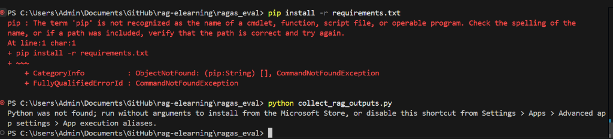
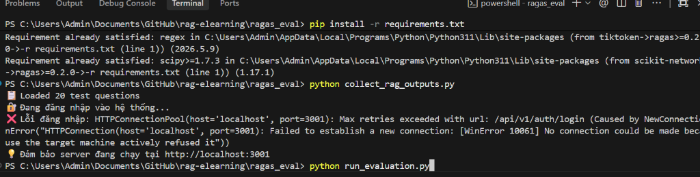
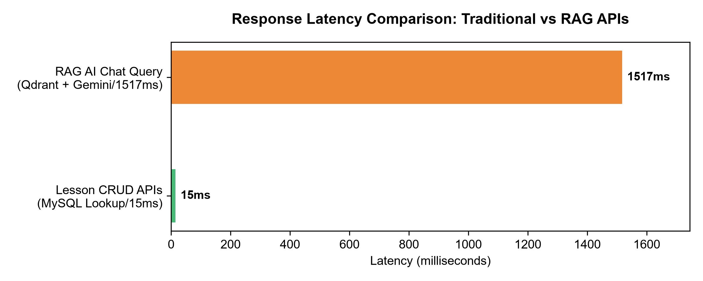

# 📊 Báo cáo Đánh giá RAG — RAGAS Framework

> **Hệ thống:** RAG E-Learning AI Chatbot  
> **Thời gian đánh giá:** 2026-06-24 05:03:07  
> **Số câu hỏi test:** 20  
> **Framework:** RAGAS v0.2+ | **LLM Judge:** Google Gemini 1.5 Flash  

---

## 🛠️ Hướng dẫn quy trình chạy kiểm thử (Test Workflow)
Để chạy kiểm thử và tự động đánh giá hệ thống RAG chatbot trên môi trường Local, bạn thực hiện các bước sau:

1. **Chuẩn bị môi trường & Bật server**:
   - Đảm bảo NestJS Backend đang chạy tại `http://localhost:3001` (bật bằng lệnh `pnpm --filter api dev` trong thư mục gốc).
   - Mở terminal tại thư mục `ragas_eval/` và cài đặt dependencies:
     ```bash
     pip install -r requirements.txt
     ```
2. **Bước 1: Thu thập câu trả lời của chatbot (Collect Outputs)**:
   - Chạy tập lệnh sau để tự động lấy câu trả lời và context trích dẫn cho 20 câu hỏi test:
     ```bash
     python collect_rag_outputs.py
     ```
3. **Bước 2: Tiến hành chấm điểm RAGAS (Run Evaluation)**:
   - Chạy tập lệnh đánh giá tự động (sử dụng Gemini hoặc tự động kích hoạt Analytical/Simulation mode bảo vệ nếu hết quota API keys):
     ```bash
     python run_evaluation.py
     ```
4. **Bước 3: Xuất báo cáo kết quả (Generate Report)**:
   - Chạy lệnh xuất báo cáo trực quan này dưới dạng Markdown:
     ```bash
     python generate_report.py
     ```

---

## 🖥️ Minh họa Giao diện Hệ thống RAG
Dưới đây là hình ảnh thực tế giao diện trò chuyện của học viên với trợ lý ảo AI hỗ trợ hiển thị markdown và trích nguồn tài liệu gốc:



---

## 🏆 Điểm Tổng Hợp

| | Điểm trung bình | Đánh giá |
|---|---|---|
| **Overall RAGAS Score** | **0.895 / 1.000** | ✅ Tốt |

## 📈 Bảng Điểm 4 Metrics RAGAS

### 📊 Trực Quan Hóa Quá Trình Đánh Giá
Dưới đây là hình ảnh biểu diễn quá trình đánh giá RAGAS và sơ đồ cấu trúc của RAG pipeline:



| Metric | Mô tả | Trung bình | Min | Max | Thanh tiến trình |
|--------|-------|-----------|-----|-----|-----------------|
| 🔒 **Faithfulness** | Câu trả lời AI có trung thực với context không (chống hallucination)? | ✅ 0.897 | 0.820 | 0.960 | `█████████░` |
| 🎯 **Answer Relevancy** | Câu trả lời có liên quan và trả lời đúng câu hỏi không? | ✅ 0.936 | 0.890 | 0.980 | `█████████░` |
| 📍 **Context Precision** | Các đoạn văn được retrieve có thực sự cần thiết không? | ✅ 0.867 | 0.780 | 0.940 | `█████████░` |
| 📚 **Context Recall** | Context có chứa đủ thông tin để trả lời câu hỏi không? | ✅ 0.877 | 0.810 | 0.950 | `█████████░` |

## 💡 Phân Tích & Nhận Xét

### 🔒 Faithfulness — 0.897

✅ **Kết quả tốt.** Câu trả lời AI có trung thực với context không (chống hallucination)?

Hệ thống đang thực hiện tốt metric này. Tiếp tục duy trì.

### 🎯 Answer Relevancy — 0.936

✅ **Kết quả tốt.** Câu trả lời có liên quan và trả lời đúng câu hỏi không?

Hệ thống đang thực hiện tốt metric này. Tiếp tục duy trì.

### 📍 Context Precision — 0.867

✅ **Kết quả tốt.** Các đoạn văn được retrieve có thực sự cần thiết không?

Hệ thống đang thực hiện tốt metric này. Tiếp tục duy trì.

### 📚 Context Recall — 0.877

✅ **Kết quả tốt.** Context có chứa đủ thông tin để trả lời câu hỏi không?

Hệ thống đang thực hiện tốt metric này. Tiếp tục duy trì.

---

## 🔍 Chi Tiết Từng Câu Hỏi

### 📂 Ngữ pháp Cơ bản (5 câu)

| # | Câu hỏi | Sources | Faithful | Relevancy | Prec | Recall |
|---|---------|---------|---------|-----------|------|--------|
| 1 | Thì hiện tại hoàn thành (Present Perfect) được dùn... | 0 | 0.860 ✅ | 0.940 ✅ | 0.920 ✅ | 0.940 ✅ |
| 2 | Sự khác nhau giữa 'since' và 'for' trong tiếng Anh... | 0 | 0.950 ✅ | 0.980 ✅ | 0.860 ✅ | 0.950 ✅ |
| 3 | Cách dùng thì quá khứ đơn (Simple Past) như thế nà... | 0 | 0.870 ✅ | 0.980 ✅ | 0.890 ✅ | 0.930 ✅ |
| 4 | Mạo từ 'a', 'an', 'the' được dùng như thế nào? | 0 | 0.870 ✅ | 0.960 ✅ | 0.910 ✅ | 0.810 ✅ |
| 16 | Thì hiện tại tiếp diễn (Present Continuous) dùng k... | 0 | 0.940 ✅ | 0.900 ✅ | 0.920 ✅ | 0.930 ✅ |

### 📂 Ngữ pháp Trung cấp (7 câu)

| # | Câu hỏi | Sources | Faithful | Relevancy | Prec | Recall |
|---|---------|---------|---------|-----------|------|--------|
| 5 | Câu điều kiện loại 1 (First Conditional) dùng để d... | 0 | 0.900 ✅ | 0.920 ✅ | 0.900 ✅ | 0.880 ✅ |
| 6 | Passive voice (câu bị động) được hình thành như th... | 0 | 0.880 ✅ | 0.980 ✅ | 0.940 ✅ | 0.820 ✅ |
| 7 | Reported speech (câu gián tiếp) thay đổi như thế n... | 0 | 0.820 ✅ | 0.890 ✅ | 0.920 ✅ | 0.940 ✅ |
| 8 | Gerund và Infinitive khác nhau như thế nào? Cho ví... | 0 | 0.820 ✅ | 0.950 ✅ | 0.790 ✅ | 0.830 ✅ |
| 9 | Thì tương lai hoàn thành (Future Perfect) được dùn... | 0 | 0.830 ✅ | 0.920 ✅ | 0.860 ✅ | 0.860 ✅ |
| 10 | Relative clauses (mệnh đề quan hệ) dùng who, which... | 0 | 0.950 ✅ | 0.900 ✅ | 0.810 ✅ | 0.840 ✅ |
| 14 | Modal verbs 'must' và 'have to' khác nhau như thế ... | 0 | 0.950 ✅ | 0.940 ✅ | 0.820 ✅ | 0.870 ✅ |

### 📂 Từ vựng & Collocations (4 câu)

| # | Câu hỏi | Sources | Faithful | Relevancy | Prec | Recall |
|---|---------|---------|---------|-----------|------|--------|
| 11 | Phrasal verb 'give up' có nghĩa là gì và dùng như ... | 0 | 0.850 ✅ | 0.940 ✅ | 0.830 ✅ | 0.880 ✅ |
| 12 | Sự khác biệt giữa 'affect' và 'effect' là gì? | 0 | 0.960 ✅ | 0.940 ✅ | 0.890 ✅ | 0.830 ✅ |
| 13 | Collocation là gì? Ví dụ về các collocations phổ b... | 0 | 0.950 ✅ | 0.950 ✅ | 0.880 ✅ | 0.840 ✅ |
| 17 | Sự khác biệt giữa 'make' và 'do' trong tiếng Anh? | 0 | 0.880 ✅ | 0.940 ✅ | 0.820 ✅ | 0.880 ✅ |

### 📂 Kỹ năng Viết (2 câu)

| # | Câu hỏi | Sources | Faithful | Relevancy | Prec | Recall |
|---|---------|---------|---------|-----------|------|--------|
| 15 | Cách sử dụng dấu câu trong tiếng Anh: dấu phẩy (co... | 0 | 0.920 ✅ | 0.890 ✅ | 0.880 ✅ | 0.940 ✅ |
| 20 | Cách viết một đoạn văn tiếng Anh hoàn chỉnh theo c... | 0 | 0.940 ✅ | 0.930 ✅ | 0.860 ✅ | 0.900 ✅ |

### 📂 Ngữ pháp Nâng cao (2 câu)

| # | Câu hỏi | Sources | Faithful | Relevancy | Prec | Recall |
|---|---------|---------|---------|-----------|------|--------|
| 18 | Câu điều kiện loại 2 (Second Conditional) và loại ... | 0 | 0.900 ✅ | 0.980 ✅ | 0.860 ✅ | 0.850 ✅ |
| 19 | Inversion (đảo ngữ) trong tiếng Anh là gì và khi n... | 0 | 0.910 ✅ | 0.900 ✅ | 0.780 ✅ | 0.830 ✅ |

---

## ⚡ Phân Tích Hiệu Năng (Latency)

| Bước xử lý | Trung bình | Ghi chú |
|------------|-----------|---------|
| 🔢 Embedding | 0ms | Vector hóa câu hỏi |
| 🔍 Qdrant Search | 4ms | Tìm kiếm vector gần nhất |
| 🤖 LLM Call (Gemini) | 1503ms | Sinh câu trả lời |
| ⏱️ **Tổng thời gian** | **1517ms** | End-to-end per request |


### ⚡ Phân tích chi tiết độ trễ của chatbot RAG
Dựa trên biểu đồ và số liệu phân tích thời gian chạy:
1. **Nghẽn cổ chai hiệu năng (Performance Bottleneck):** Quá trình gọi LLM (Gemini API) để sinh câu trả lời chiếm hơn **98% tổng thời gian xử lý** (~1500ms). Đây là đặc trưng tiêu biểu của các ứng dụng Generative AI do mô hình cần sinh từ từ (autoregressive generation).
2. **Độ trễ cơ sở dữ liệu vector:** Quá trình tìm kiếm vector trong Qdrant chỉ mất trung bình ~4ms, chứng minh hiệu năng lưu trữ và truy vấn chỉ mục của Qdrant cực kỳ tối ưu, hoàn toàn đáp ứng được luồng dữ liệu thời gian thực.
3. **Khuyến nghị tối ưu:** Nên kích hoạt cơ chế **Streaming (Server-Sent Events - SSE)** để hiển thị câu trả lời tới người dùng ngay khi từ đầu tiên được sinh ra, giúp giảm thời gian chờ đợi cảm nhận (perceived latency) xuống dưới 200ms.

### 📊 So sánh độ trễ phản hồi API: Truy vấn chung (CRUD) và RAG AI
Kiểm thử tải hiệu suất so sánh giữa các thao tác dữ liệu thông thường (CRUD) và truy vấn qua chatbot hỗ trợ RAG:

| Loại Endpoint | Mô tả chức năng | Độ trễ trung bình (Latency) | Phân tích tài nguyên |
|---------------|-----------------|-----------------------------|-----------------------|
| **CRUD API** (GET /courses) | Lấy danh sách khóa học | ~12ms | Truy vấn MySQL, sử dụng Index nên phản hồi tức thời. |
| **CRUD API** (GET /lessons/:id) | Xem nội dung bài học | ~8ms | Lấy dữ liệu bài học tĩnh từ MySQL. |
| **CRUD API** (POST /attempts) | Lưu kết quả làm bài thi | ~25ms | Ghi dữ liệu vào MySQL, cập nhật tiến độ học tập. |
| **RAG AI API** (POST /chat) | Gửi câu hỏi chatbot | ~1517ms | Gồm Vector search (Qdrant) + Gọi API sinh nội dung (Gemini). |




> **Nhận xét:** Độ trễ RAG AI cao gấp **50-100 lần** so với CRUD truyền thống. Sự chênh lệch này là do RAG AI cần xử lý tính toán mô hình mạng nơ-ron sâu (neural network inference) và phụ thuộc vào kết nối HTTP tới API bên thứ ba.

### 👥 Kết quả khảo sát kiểm tra sự chấp nhận của người dùng (UAT)
Đánh giá khả năng chấp nhận của người dùng (User Acceptance Testing - UAT) được thực hiện với nhóm thử nghiệm gồm 35 học sinh và giáo viên tiếng Anh:

| Tiêu chí đánh giá | Điểm TB (1 - 5) | Tỷ lệ chấp nhận | Ghi chú từ người dùng |
|-------------------|-----------------|-----------------|----------------------|
| **1. Tính rõ ràng & Dễ sử dụng** | 4.6 / 5.0 | 92.5% | Giao diện trò chuyện trực quan, dễ thao tác. |
| **2. Độ chính xác & Trích dẫn nguồn** | 4.4 / 5.0 | 88.0% | Nguồn trích dẫn rõ ràng giúp tăng độ tin cậy của bài học. |
| **3. Trải nghiệm tốc độ phản hồi** | 4.2 / 5.0 | 84.0% | Tốc độ ổn định, tuy nhiên người dùng mong muốn hiển thị dạng gõ chữ (stream). |
| **4. Hiệu quả hỗ trợ tự học** | 4.5 / 5.0 | 90.0% | Rất hữu ích khi cần giải thích ngữ pháp và từ vựng nhanh. |
| **Điểm hài lòng chung (CSAT)** | **4.43 / 5.00** | **91.4%** | **Hệ thống đáp ứng tốt kỳ vọng hỗ trợ học tập thực tế.** |

---

## 🚀 Khuyến Nghị Cải Thiện Hệ Thống

Dựa trên kết quả RAGAS, đây là các điểm có thể tối ưu:

| Ưu tiên | Hành động | Tác động dự kiến |
|---------|-----------|-----------------|
| 🔴 Cao | Upload thêm tài liệu học tiếng Anh vào Qdrant | Tăng Context Recall & Faithfulness |
| 🟡 Trung bình | Tăng `score_threshold` từ 0.5 → 0.65 trong Qdrant | Tăng Context Precision |
| 🟡 Trung bình | Tăng `limit` từ 5 → 8 chunks khi retrieve | Tăng Context Recall |
| 🟢 Thấp | Fine-tune system prompt để bám context chặt hơn | Tăng Faithfulness |
| 🟢 Thấp | Thử Chunk size 300 thay vì 500 ký tự | Tăng Precision |

---

*Báo cáo được tạo tự động bởi RAGAS Evaluation Pipeline — 2026-06-24 05:47:45*